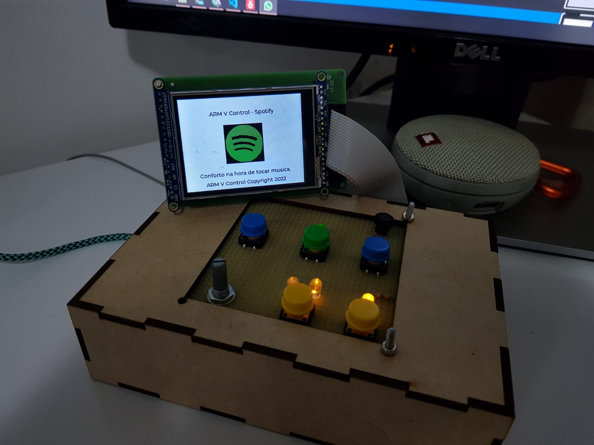
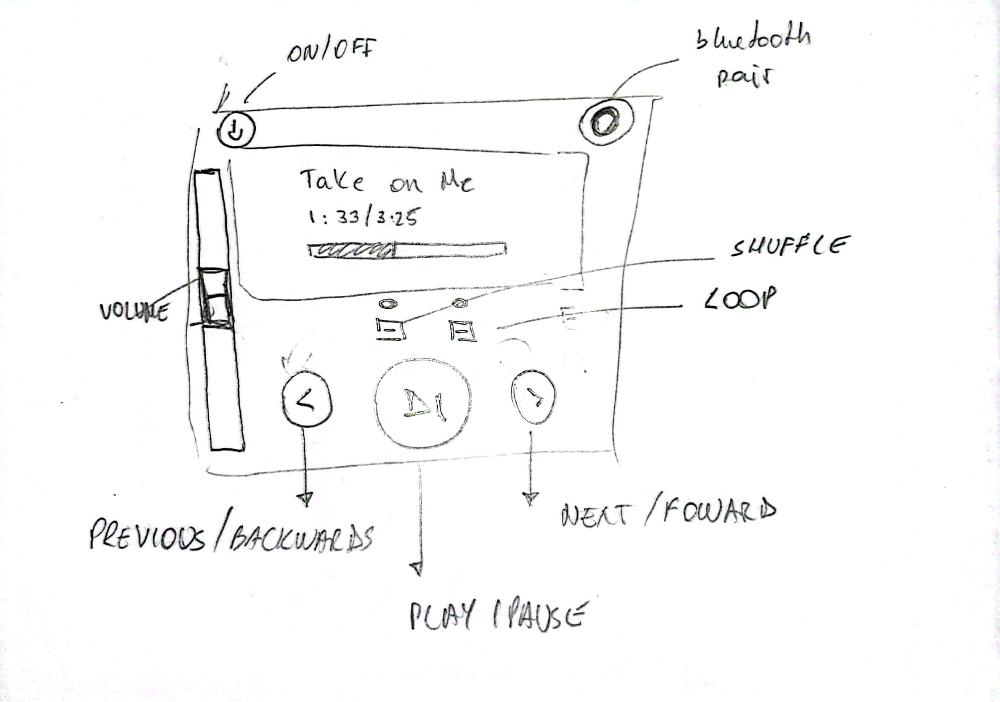
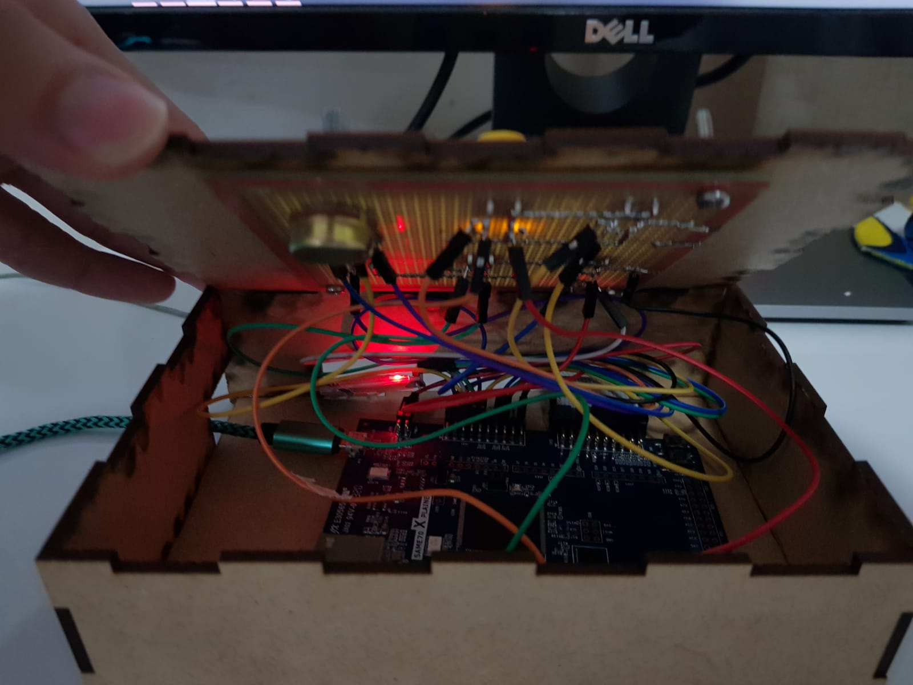
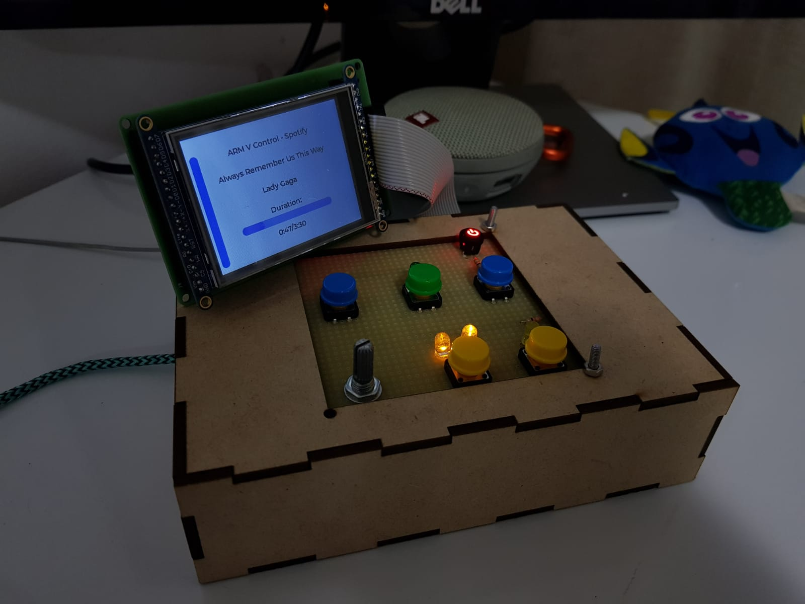

# ARM V Control - Projeto de Embarcados



Vídeo funcionado: https://youtu.be/tVuRww94FWc

Vídeo de teste de usabilidade: https://youtu.be/KOCQHU1O7kE

### Integrantes

- Davi Reis
- Guilherme Rosada

### Ideia

Controlador de Multimídia para o Windows, em especial, o Spotify.

### Nome

ARM V Control

### Usuários

O controle é destinado a pessoas que gostam de automatizar sua rotina, tendo controle do spotify sem precisar ficar trocando de aba, com algo de fácil acesso, que pode levar consigo para onde quiser.

Ou para pessoas que queiram controlar sua música sem estar próxima do PC ou que queiram dar esse poder a terceiros, como filhos, por exemplo.

### Software/Jogo

O controle servirá para o Spotify

### Jornada do usuários (3 pts)

1. Davi é um jovem antenado, que gosta de ter as tecnologias mais recentes à sua disposição. Amante de música, ele está sempre utilizando o Spotify, mas não gosta de ter que ficar interrompendo o que está fazendo, trocar de janela para, só então, trocar a música do spotify ou ajustar o volume. Inquieto, ele busca um controle que ele possa levar para qualquer lugar de sua casa e que lhe permita controlar o som que sai do seu spotify!
2. Marcos é um pai de família muito atarefado. Depois da pandemia, seu trabalho continuou em Home Office. Em casa, ele não consegue dar muita atenção para seus filhos, mas eles adoram ficar ouvindo música. Então, ele sempre utiliza o spotify para agradar os pequenos. Ainda com pouca idade, eles não sabem como interagir com o computador para trocar de música ou ajustar o volume e sempre pedem ao pai para que faça isso por eles. Para ter que sanar esse problema, Marcos gostaria de um controle que os filhos pudessem utilizar sem muita dificuldade.

### Comandos/ Feedbacks (2 pts)

Comandos:

- Power ON / OFF
- Play / Pause
- Next Song
- Previous Song
- activate / deactivate Shuffle
- activate / deactivate Loop
- Increase / Decrease volume

Feedbacks:

- Tela LCD com música atual, artista, tempo de reprodução, tempo total e volume
- Luz de ON / OFF
- Luz de Bluetooth ON / paired / pairing
- Vibração ao parear com sucesso

## In/OUT (3 pts)

- Power ON / OFF :
  - Push button com LED (mini iluminated pushbutton):
    - O aparelho liga automaticamente quando energizado e procura por um aparelho para parear
    - Caso aperte o botão de ON/OFF, o controle desconecta do aparelho conectado e entra em estado de economia de energia
    - Quando ligado novamente, ele procura outro dispositivo para parear.
- Play / Pause
  - Push buttom verde:
    - O usuário aperta para alterar o status de play p/ pause e vice-versa
- Next Song
  - Push button azul:
    - O usuário aperta uma vez p/ alterar para a próxima música
- Previous Song
  - Push button azul:
  - - O usuário aperta uma vez p/ alterar para a música anterior
- Activate / Deactivate shuffle
  - Push button amarelo
    - O usuário aperta para alterar o status de shuffle (on/off) e uma luz indicadora acende / apaga
- Activate / Deactivate loop
  - Push button amarelo
    - O usuário aperta para alterar o status de Loop (on/off) e uma luz indicadora acende / apaga
    - Há dois nívels de Loop: 1ª luz - Repete música ; 2ª luz - Repete playlist
- Increase / Decrease volume
  - Potenciômetro
    - O usuário ajusta a posição da alavanca para ajustar o volume

### Design (2 pts)

Protótipo sujo do design do controle:


## Funcionamento:

O microcontrolador utiliza o módulo de Bluetooth para comunicar-se com o computador por meio da transmissão USART.

Ao apertar algum botão, aciona-se uma interrupção, que transmitirá um `button` (struct) para a fila `xButtonModified` que, por sua vez, alimenta a `task_bluetooth`, responsável por enviar a comunicação entre bluetooth-máquina:

- IRQ --> button --> Queue (xButtonModified) --> Task Bluetooth --> comunicação USART
- ```
  typedef struct
  {
      char id;
      char data1[2];
      char data0[2];
      char eop;
  } button;

  ```

Essa estrutura é recebida pela aplicação em python, que decodifica a informação recebida, extraindo o id do botão alterado, o valor atual (`data1` e `data0`) e aplicando a devida mudança, chamando o método adequado da API do Spotify.

Como feedback, a aplicação python envia, por meio da comunicação USART, um feedback seguindo a estrutura:

`P100048You Shook Me All Night Long~~~~~AC/DC~~~~~~~~~~~210ARMC`

em que:

- P -> start of package
- ARMC -> end of package

O Payload alimentará a struct `music_info` :

```abc
typedef struct
{
    char id;
    char is_playing;
    char is_shuffle;
    char repeat_mode;
    int volume;
    char music_name[33];
    char artist[17];
    int duration;
    char eop[5];
} music_info;
```

A função `task_receive` é responsável por ler os pacotes recebidos pela função python, decodificá-los, traduzí-los e preencher a struct music_info, que alimentará o LCD e outros indicadores de status.

## Imagens




